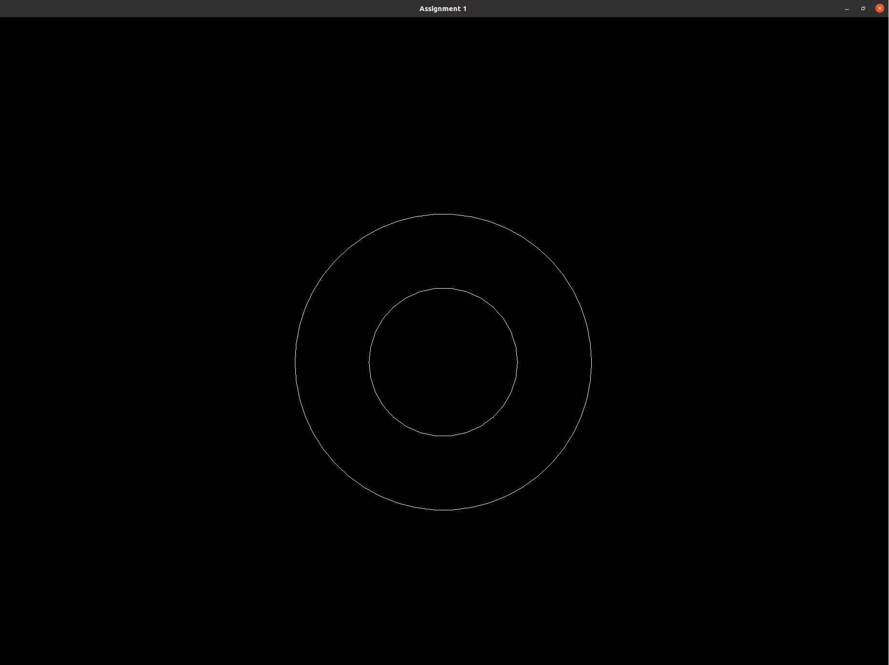
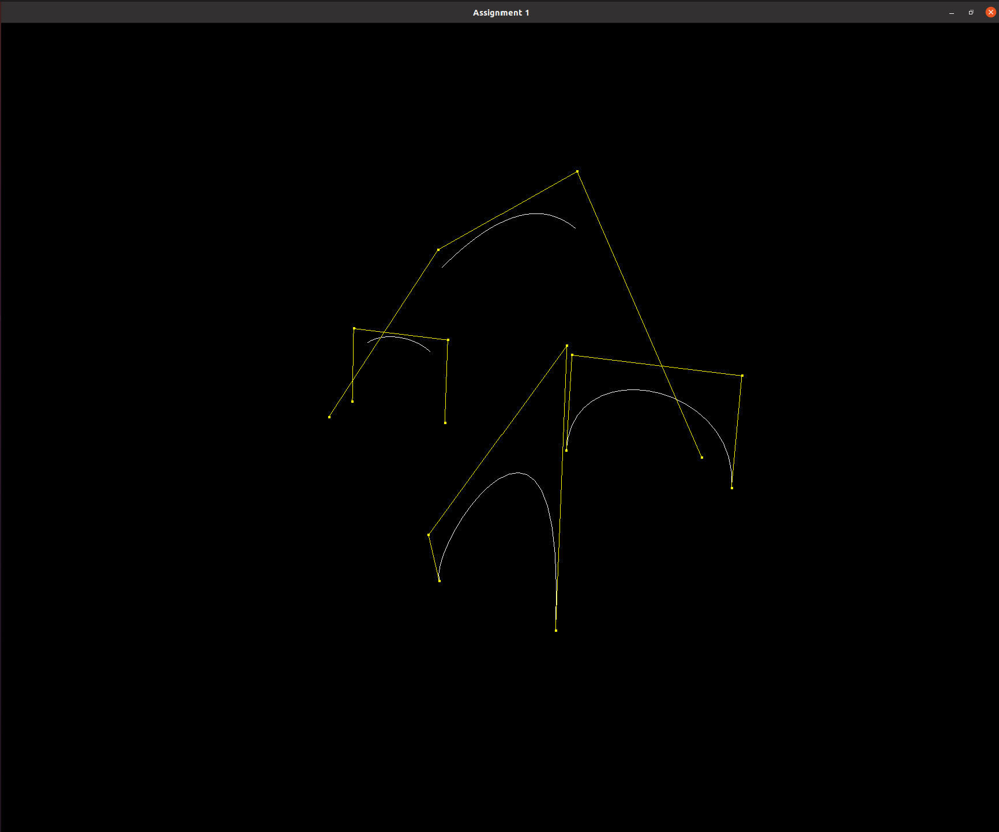
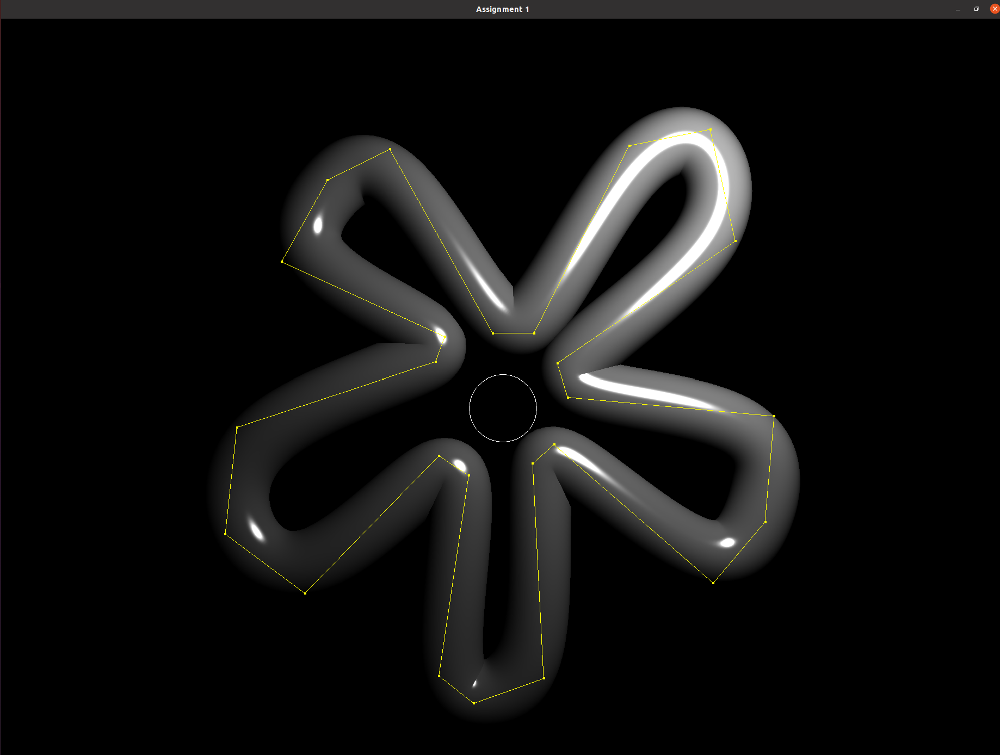
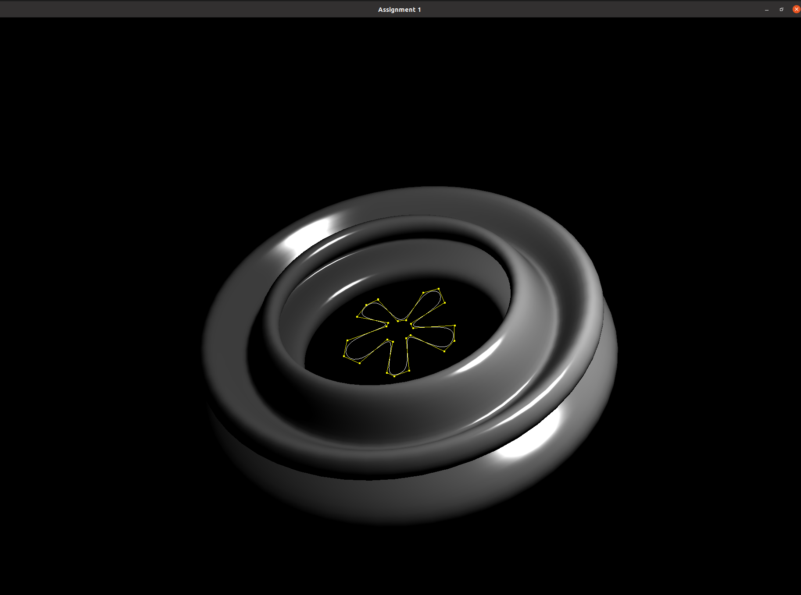
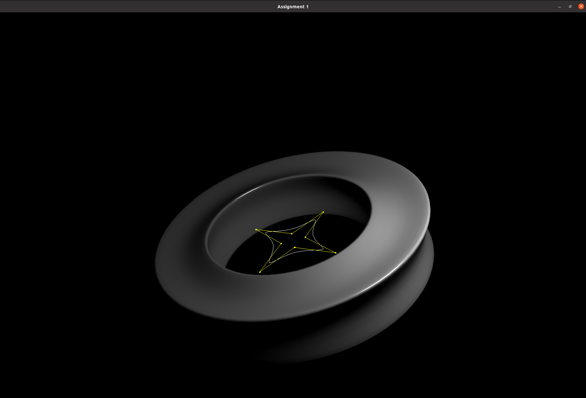
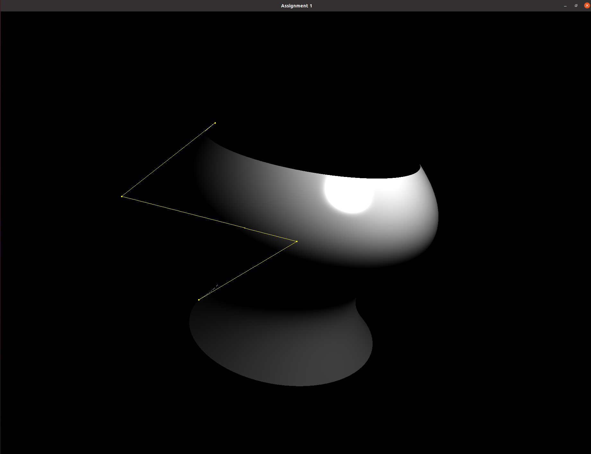
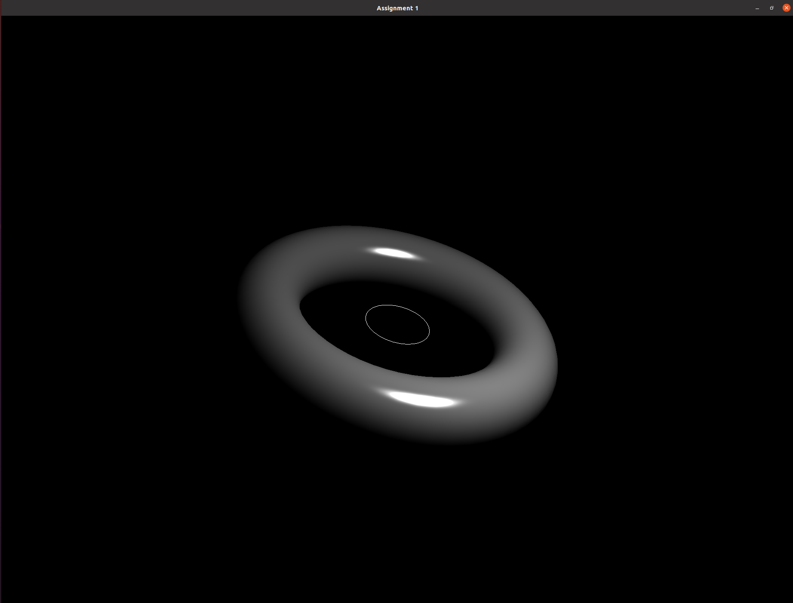
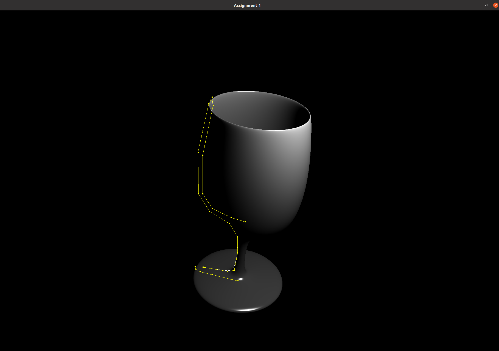
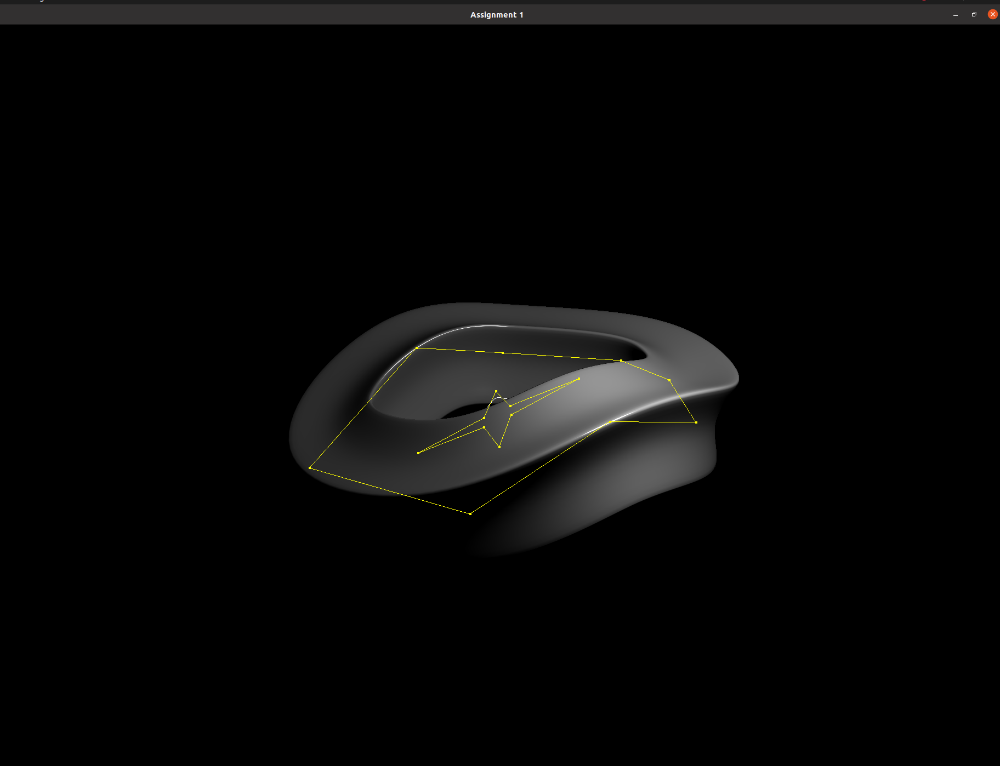
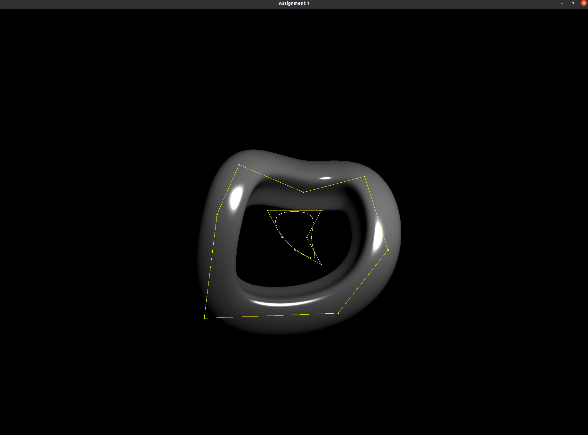

# Project1: 曲线和曲面造型技术  
## 实验环境  
- Ubuntu-20.04.6  
## 实验结果截图  
<center>
  
  








</center>

## 任务一：曲线绘制  
&emsp;&emsp;为了绘制三维曲线，我们需要足够多的 **曲线上的点** 的信息；对于每一个点，我们需要知道其 **坐标 V**，**（单位） 切向量 T**，**（单位）法向量 N** 以及 **（单位）次法向量 B**，其中次法向量 B 是任一与切向量 T 不平行的向量，它的引入是为了求取法向量 N。  
&emsp;&emsp;由于在三维空间中，曲线的切向量可能会向次法向量 B 的方向旋转，故我们 **不能使用固定的 B 向量**，而应该采取递推的方式，“点动成线”，逐个确定各点的信息。具体而言，在第 i 步中，我们可以计算第 i 个点的有关信息：
$$
V_i=q(t_i)\\
T_i=q'(t_i).normalized()\\
N_i=(B_{i-1}\times T_i).normalized()\\
B_i=(T_i\times N_i).normalized()
$$
&emsp;&emsp;其中，q(t) 是曲线的参数方程表示，normalized() 表示向量单位化操作。    
### 三次贝塞尔曲线（B´ezier）  
&emsp;&emsp;**`n 次贝塞尔曲线`** 由 (n + 1) 个 **控制点** $P_i,P_2\cdots P_n$ 生成，每个控制点的系数称 **`n 次 Bernstein 基函数`**，记为 $BEZ_{i,n}(t)=C^i_nt^i(1-t)^{n-i}, t\in[0,1]$。于是 3 次贝塞尔曲线表达式为 $P(t)=\sum^3_{i=0}P_iBEZ_{i,n}(t),t\in[0,1]$，将其写为矩阵向量相乘的形式即为  
<center>

</center>


&emsp;&emsp;这里的 P(t) 就是前文的 q(t)，将其代入公式逐点计算即可。我们要求 **控制点的数目一定是** $3n+1$，这是因为每 4 个控制点为一组，分段绘制曲线；而为了保证各段曲线之间相连，又要求各分段 **端点处的控制点** 相同，故总控制点数一定是 $3n+1$。  
&emsp;&emsp;值得注意的是，为了运用 `vecmath` 中实现的各辅助方法，我们将 $P_1, P_2, P_3, P_4$ 扩展至 4 维，这样就可以使用 **四维矩阵** 来表示 $[P_1, P_2, P_3, P_4]$，方便计算。而 **矩阵-向量乘法，向量叉积** 等方法都已经实现好，只需调用即可。     
### 三次B-样条曲线（Bspline）  
&emsp;&emsp;**三次B-样条曲线** 与 **三次贝塞尔曲线** 十分相似，区别仅在于 **系数矩阵不同** 与 **控制点利用方式** 不同。B-样条曲线控制点数大于4即可，绘制时逐点右移即可；而矩阵表示如下：  
<center>

</center>

&emsp;&emsp;其余仿照三次贝塞尔曲线编码即可。  

## 任务二：曲面绘制  
&emsp;&emsp;曲面绘制的关键在于，**在相邻两条曲线之间的对应位置连线，构成三角形**，在OpenGL中，我们需要按照特定的顺序指定顶点和绘制法向量，三角形必须以 **逆时针** 绘制，否则就会有 **不正确的照明计算**，如图：  
<center>

</center>

### 旋转曲面   
&emsp;&emsp;旋转曲面被定义为 **xy平面上的二维曲线** 绕正 Y 轴 **逆时针旋转** 扫掠过的面积。正如前述，我们以曲线之间的三角形来形成面，而且要求 **法线方向朝向曲面外侧**，这与曲线的法线方向正好相反。  
&emsp;&emsp;对于曲线的旋转可以使用旋转矩阵来表示，绕正 Y 轴逆时针旋转 $\theta$ 角对应的矩阵为  
<center>

</center>

&emsp;&emsp;而对应的法向量计算方法则为 $N'=normalized((M^{-1})^\top N)$。在代码中，曲面被建模为 **顶点集 VV，法线集 VN 与三角形集 VF**，按照给定的步长逐条添加即可，核心代码如下：  
```C++
// 旋转矩阵，theta角
float theta = 2 * pi / steps;
Matrix4f M = Matrix4f::rotateY(theta);
for(unsigned i = 0; i < steps; ++i){
    for(unsigned j = 0; j < profile.size(); ++j){
        int offset = i * profile.size() + j;
        // 点坐标
        Vector4f P_dot = M * Vector4f(VV[offset], 0);
        VV.push_back(P_dot.xyz());
        // 法向量
        Vector4f N_dot = M.inverse().transposed() * Vector4f(VN[offset], 0);
        VN.push_back(N_dot.xyz().normalized());
        // 三角形
        if(j < profile.size() - 1)// BAC
            VF.push_back(Tup3u(offset + profile.size(), offset, offset + 1));
        if(j > 0)// DBC
            VF.push_back(Tup3u(offset + profile.size(), offset + profile.size() - 1, offset));
    }
}
```  

### 广义圆柱体  
&emsp;&emsp;广义圆柱体是 **轮廓曲线 `profile` 沿着扫掠曲线 `sweep` 平移** 形成的曲面，关于法线和三角形的定义则与旋转曲面相同。具体而言，将 profile 上各点按照 sweep 曲线上各点的坐标系（NBTV）进行变换，如下：  
<center>

</center>

&emsp;&emsp;将核心代码抽取为 `DrawProfile()` 方法如下
```C++
void DrawProfile(Matrix4f& M, const Curve &profile, vector<Vector3f>& VV, vector< Vector3f >& VN, vector< Tup3u >& VF, int i){
    for(unsigned j = 0; j < profile.size(); ++j){
        // 点坐标
        Vector4f PDot = M * Vector4f(profile[j].V, 1);
        VV.push_back(PDot.xyz());

        // 法向量
        Vector4f N_dot = M.inverse().transposed() * Vector4f(profile[j].N, 1);
        VN.push_back(-N_dot.xyz().normalized());

        // 三角形，相邻两圈之间的对应点绘制
        if(i != 0){
            unsigned index = (i - 1) * profile.size() + j;
            VF.push_back(Tup3u(
                index, 
                index + 1 == i * profile.size() ? index - j : index + 1, 
                index + profile.size()
            ));
            VF.push_back(Tup3u(
                index, 
                index + profile.size(), 
                index + profile.size() - 1 == i * profile.size() - 1 ? (i + 1) * profile.size() - 1 : index + profile.size() - 1
            ));
        }
    }
}
```
## 扩展任务：曲面的闭合问题  
&emsp;&emsp;对于广义圆柱体存在曲面不闭合的问题，尽管 `sweep` 是闭合曲线，但是首尾两点的 **法向量方向** 有可能不同，这就导致连接处的 `profile` 出现错位，使曲面不闭合。解决方法是将 `sweep` 曲线上 **各点的法向量进行渐变地旋转**，假设原先首末点的法向量夹角为 $\alpha$，`sweep` 曲线共有 n 个点，则第 i 个点的法向量需旋转 $\frac{i\alpha}{n}$ 角度，这样就使得首尾两点的法向量方向得以保持一致，同时不破坏原曲面的造型。  
&emsp;&emsp;首先要判断曲面是否存在不闭合的问题，依据是首尾两点的切向量相同而法向量不同，注意不能直接使用 `mathvec` 中的 `==` 来判断，因为这涉及浮点数比较，应当自行定义 `approx()` 函数，如下：  
```C++
bool approx(const Vector3f& lhs, const Vector3f& rhs)
{
	const float eps = 1e-8f;
	return (lhs - rhs).absSquared() < eps;
}
```  
&emsp;&emsp;只需要在检测到曲面不闭合时，调整 `sweep` **各点的法向量 N 与次法向量 B** 即可，其他与广义圆柱体的绘制代码完全相同，如下：  
```C++
// 是否存在曲面不闭合问题
bool inCont = approx(sweep[0].T, sweep[sweep.siz() - 1].T) && !approx(sweep[0].N, sweep[sweep.siz() - 1].N);

// 沿着sweep拷贝profile
for(unsigned i = 0; i < sweep.size(); ++i){
    CurvePoint inter(sweep[i]);
    if(inCont){
        float theta = -acosf(Vector3f::dot(sweep[0].N, sweep[sweep.size() - 1].N)) / sweep.size() * (i + 1);
        inter.N = cos(theta) * inter.N + sin(theta) * inter.B;
        inter.B = Vector3f::cross(inter.T, inter.N);
    }
    Matrix4f M(
        inter.N[0], inter.B[0], inter.T[0], inter.V[0],
        inter.N[1], inter.B[1], inter.T[1], inter.V[1],
        inter.N[2], inter.B[2], inter.T[2], inter.V[2],
        0, 0, 0, 1
    );
    DrawProfile(M, profile, VV, VN, VF, i);
}
```