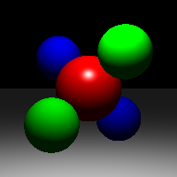
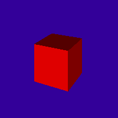
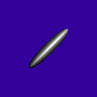
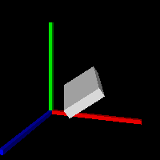
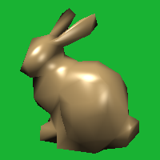
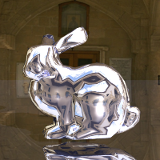
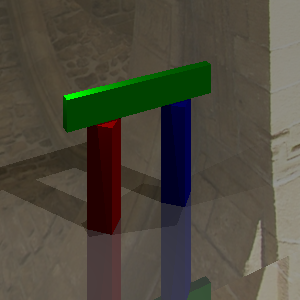
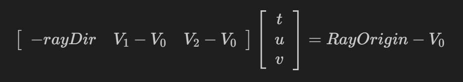

# Project2: 光照模型与光线追踪  
## 实验环境  
- Ubuntu-20.04.6  
## 实验概述  
&emsp;&emsp;**光线** 建模为 `Ray` 类，表示为 `Origin + t * Direction`。当光线与物体相接，将 **接触点** 建模为 `Hit` 类，记录了接触点的材质 `material`，接触点在面上的法线 `normal`，以及光线在这一点所对应的 `t` 值。而不同光源的 **光照强度计算方法** 不同，故封装为另一个类 `Light`，包括点光源与平行光源。光线从相机出发，向图像的每个像素发射光线，`Render()` 为每个相机光线 **递归调用** `traceRay()` 方法，追踪光线求解当前像素的颜色值。  
## 实验结果  
&emsp;&emsp;在build目录中生成 `a2` 后，可以在根目录下运行 `test_cases.sh` 来生成结果，其中样例生成的结果命名为 `序号+S`，而程序生成的结果以序号命名，如下：  
<center>







</center>

&emsp;&emsp;**由于 `-jitter` 等待时间较长，故在脚本文件中没有使用，可以自行添加验证。**  
## 任务一: Phong 光照模型  
&emsp;&emsp;Phong 光照模型就是 **环境光（`AmbientLight`）**，**漫反射（`DiffuseLight`）** 和 **镜面反射（`SpectularLight`）** 的结合。其中，环境光是场景自带的光线，可以直接使用 `_scene.getAmbientLight()` 来得到，而后两者需要将各个光源所得到的结果累加。  
- **`PointLight::getIllumination()`**  
&emsp;&emsp;该函数适用于点光源，给定空间中一个点，计算它到光源的 **距离，方向** 以及该点得到的 **光强**，以引用方式传出。点光源的光强公式为 $I=\frac{I}{\alpha d^2}$，其中 I 为光源光强，$\alpha$ 为衰减系数，d 为距离。如下：  
```C++
void PointLight::getIllumination(const Vector3f p, 
                             Vector3f &tolight, 
                             Vector3f &intensity, 
                             float &distToLight) const
{
    tolight = (_position - p).normalized();
    distToLight = (_position - p).abs();
    intensity = _color / (_falloff * distToLight * distToLight);
}
```  

- **`Material::shade()`**  
&emsp;&emsp;在本方法中计算 `Phong` 光模型的后两项，只需要按照理论模型进行实现即可，代码如下：  
```C++
Vector3f Material::shade(const Ray &ray,
    const Hit &hit,
    const Vector3f &dirToLight,
    const Vector3f &lightIntensity)
{
    Vector3f I_diffuse(0);
    Vector3f I_spectular(0);
    float dotLN = Vector3f::dot(dirToLight, hit.getNormal());
    if(dotLN > 0){
        // 定义三元向量的乘为各分量分别相乘，符合题意
        // 注意这里的L和内积中的L不一样！
        I_diffuse = dotLN * lightIntensity * _diffuseColor;
    }
    // 对称向量为 2 * p - a，p为在法线上的投影
    Vector3f project = Vector3f::dot(-ray.getDirection(), hit.getNormal()) * hit.getNormal();
    float dotLR = Vector3f::dot(2 * project + ray.getDirection(), dirToLight);
    if(dotLR > 0)
        I_spectular = powf(dotLR, _shininess) * lightIntensity * _specularColor;
    return I_diffuse + I_spectular;
}
```
- **`Renderer::traceRay()`**  
&emsp;&emsp;在本方法中将完成 `Phong` 光照模型的全部计算，遍历环境中的所有光源，计算其漫反射与镜面反射光强，再加上环境光，计算公式为 $I=L_{ambient}\cdot k_{diffuse} + \sum_{i\in lignts}(I_{diffuse,i}+I_{specular,i})$。  

## 任务二：光线投射  
&emsp;&emsp;需要实现 `Object3D` 抽象类的各个子类，包括 `Plane`，`Triangle` 与 `Transform` 类的 `intersect` 方法，判断物体与光线是否相交。  

- **`Plane 类`**  
&emsp;&emsp; `Plane` 类是无穷大平面，可以使用平面的 **法向量 _normal** 与平面与原点的 **距离（有符号）_dist** 来表示。可以使用通用的 **待定系数法** 求解，设直线上的点为 $o + t \cdot d$，然后将其代入平面方程即可。也可以依据物体特性求解，平面无交点等价于 **光线不与法向量垂直**，此外，即使求出交点也应要求交点 **不在摄像机后方**，既求出的 t 要大于 `tmin`。此外，如果求出了符合条件的点，我们需要 **更新 `Hit` 为最新的光线交点**，代码如下：  
```C++
bool Plane::intersect(const Ray &r, float tmin, Hit &h) const
{
    // 1. 平行无交点
    if(fabs(Vector3f::dot(_normal, r.getDirection())) < 1e-6)
        return false;
    // 2. t的下限，不能落在摄影机之后
    float t = Vector3f::dot(_dist * _normal - r.getOrigin(), _normal) / Vector3f::dot(_normal, r.getDirection());
    if (t < tmin)
    	return false;
    if (t < h.getT()) {
        h.set(t, this->material, _normal);
        return true;
    }
    return false;
}
``` 

- **`Triangle 类`**  
&emsp;&emsp;对于三角形与光线相交问题，使用 **Möller-Trumbore 算法**，算法基于一个线性方程组： 
<center>

</center> 

&emsp;&emsp;其中，$RayOrigin-V_0=(1-u-v)V_0+uV_1+vV_2$，如果求出的 $u, v, (1 - u - v)$ 均在零到一之间，则说明有交点。关于 t 的大小以及 `Hit` 的更新则与 `Plane` 类一致，代码如下：  
```C++
bool Triangle::intersect(const Ray &r, float tmin, Hit &h) const 
{
    // assert na nb nc 一样
    Vector3f normal = _normals[0];
    // Möller-Trumbore 算法
    Matrix3f A(-r.getDirection(), _v[1] - _v[0], _v[2] - _v[0]);
    Vector3f ans = (A.inverse() * (r.getOrigin() - _v[0]));
    float t = ans[0];
    if(!(ans[0] >= tmin && ans[1] > 0 && ans[1] < 1 && ans[2] > 0 && ans[2] < 1 && ans[1] + ans[2] < 1))
        return false;

    if (t < h.getT()) {
        normal = Matrix3f(_normals[0], _normals[1], _normals[2]) * Vector3f(1-ans[1]-ans[2], ans[1], ans[2]);
        h.set(t, this->material, normal.normalized());
        return true;
    }
    return false;
}
```  

- **`Transform 类`**  
&emsp;&emsp;该类的作用是进行坐标变换，`Hit` 中存储的坐标是局部坐标，而 `Ray` 类使用的则是世界坐标，在调用具体类型的 `intersect` 判断时有必要转换为相同的坐标系。相比于将复制的 **对象转换到世界坐标**，更合适的做法是将 **光线转到局部坐标中**。`Transform` 将存储坐标转换的变换矩阵，代码如下：  
```C++
bool Transform::intersect(const Ray &r, float tmin, Hit &h) const
{
    // 光线转到局部坐标系
    Ray rLocal(
        (_m.inverse() * Vector4f(r.getOrigin(), 1)).xyz(), 
        (_m.inverse() * Vector4f(r.getDirection(), 0)).xyz()
    );
    if(_object->intersect(rLocal, tmin, h)){
        // 将h中的局部法向量转回世界坐标系
        h.set(
            h.getT(), 
            h.getMaterial(), 
            (_m.inverse().transposed().getSubmatrix3x3(0, 0) * h.getNormal()).normalized()
        );        
        return true;
    }
    return false;
}
```  

## 任务三：光线追踪与阴影投射  
- **`Renderer::traceRay()` 光线追踪**  
&emsp;&emsp;除了光源的直接照射外，光线还有可能 **来自反射光**，故我们需要从光线的最新反射点 h 开始，人工引出 **新的反射光线** 并且递归调用 `Renderer::traceRay()`，递归深度由参数 `bounces` 决定，部分核心代码如下：  
```C++
// 最大反射深度bounces
if(bounces > 0){
    Vector3f Project = Vector3f::dot(-r.getDirection(), h.getNormal()) * h.getNormal();
    Vector3f R = (r.getDirection() + 2 * Project).normalized();
    // 避免噪声
    Ray right(r.pointAtParameter(h.getT()) + 0.01 * R, R);
    Hit new_hit = Hit();
    res += traceRay(right, 0, bounces - 1, new_hit) * (h.getMaterial()->getSpecularColor());
}
```

- **`Renderer::traceRay()` 阴影投射**  
&emsp;&emsp;判断阴影的方法很简单，如果接触点得到的光线反向后不能直接到达光源，而是会 **先与环境碰撞**，则说明该光线是不会到达的，此时不应该将该该光线带来的光强加入结果，我们只需在 **计算总光强的循环中加入阴影的判断** 即可，核心代码如下，注意虚拟光的 **起始点要偏离** 一些，否则射线原点会被判定为碰撞，导致阴影判定总为真：  
```C++
// 计算阴影
if(_args.shadows){
    Ray Inverse(Point, dirToLight);
    Hit InverseHit = Hit();
    if(_scene.getGroup()->intersect(Inverse, 0.0001, InverseHit))
        continue;
}
```

## 扩展任务：抗锯齿问题    
- **`jitter`（抖动采样）**  
&emsp;&emsp;我们在 `Render()` 的循环里重复采样16次，即重复进行 `generateRay` 和 `traceRay` 过程，每次都对 ndcx, ndcy加上一定的偏差，偏差的值从0到1的像素宽度随机选取，计算结果的 `color，normal，t` 都取平均值作为最终结果：  
```C++
// 剩余15次采样取平均
if(_args.jitter){
    Vector3f avg_normal(h.getNormal());
    float avg_t(h.getT());
    Vector3f avg_color(color);
    for(int i = 1; i < 16; ++i){
        Hit _h = Hit();
        random_x = (1.0 * rand()) / RAND_MAX;
        random_y = (1.0 * rand()) / RAND_MAX;   
        random_x = ndcx + random_x * wbase;
        random_y = ndcy + random_y * hbase;
        
        Ray r = cam->generateRay(Vector2f(random_x, random_y));
        Vector3f _color = traceRay(r, cam->getTMin(), _args.bounces, _h);    
        //_color.print();   
        avg_normal += _h.getNormal();
        avg_t += _h.getT();
        avg_color += _color;              
    }
    h.set(avg_t / 16.0f, h.getMaterial(), avg_normal / 16.0f);
    color = avg_color / 16.0f;
}
```  
- **`filter`（控制上采样和高斯滤波）**  
&emsp;&emsp;这种抗锯齿的方法是首先 **按照更高分辨率进行计算**（相当于在原分辨率图像基础上上采样），然后再进行池化，方法是通过 **高斯滤波器** 来逐块池化。这里采用 k=3，也就是在上采样中长宽都调整为原先的 3 倍，然后采用三维的高斯滤波器，每 $3\times 3$ 的块计算出一个值，就能够降低回原分辨率。   
<center>

</center>

&emsp;&emsp;对于上采样步骤，我们可以直接利用原有的计算代码，只需将 **长宽都调整为3倍** 即可。而对于池化步骤，在循环结束后得到的高分辨率图像上滑动计算即可。  
```C++
// 渲染完毕后下采样
if(_args.filter){
    Image k_image(w / 3, h / 3);
    Image k_nimage(w / 3, h / 3);
    Image k_dimage(w / 3, h / 3);
    Matrix3f kernal(
        1, 2, 1,
        2, 4, 2,
        1, 2, 1
    );
    kernal = kernal * (1.0 / 16);
    for(int j = 0; j < h / 3; ++j){
        for(int i = 0; i < w / 3; ++i){
            Image local(3, 3);
            Image nlocal(3, 3);
            Image dlocal(3, 3);

            fillLocal(image, local, i, j);
            fillLocal(nimage, nlocal, i, j);
            fillLocal(dimage, dlocal, i, j);

            k_image.setPixel(i, j, dowm_sample(kernal, local));
            k_nimage.setPixel(i, j, dowm_sample(kernal, nlocal));
            k_dimage.setPixel(i, j, dowm_sample(kernal, dlocal));

        }
    }
    image = k_image;
    dimage = k_dimage;
    nimage = k_nimage;
}
```
